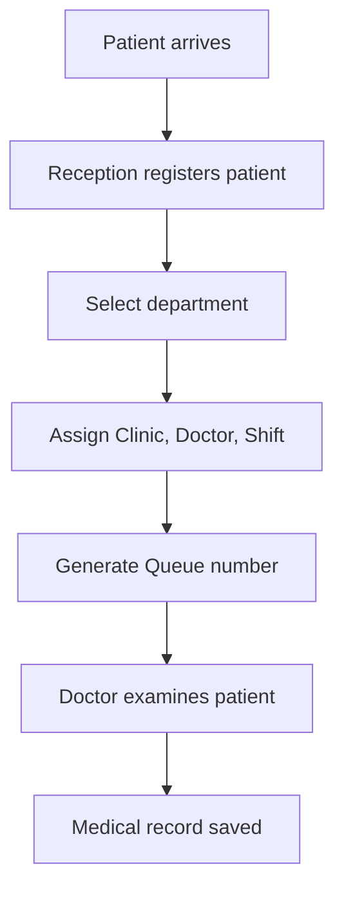
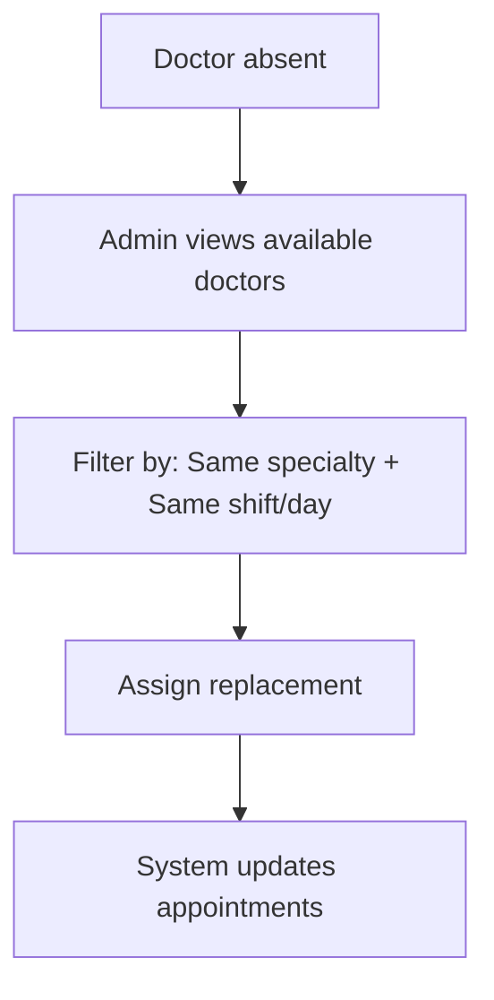

# Hospital Information & Clinic Management System

> A comprehensive Hospital Information & Clinic Management System built with **Angular** frontend and **Spring Boot** backend (uses JSON file for testing with dummy data).

## 📦 Required Dependencies

- **PrimeNG** - UI Component Library
- **Bootstrap** - CSS Framework
- **Font Awesome** - Icon Library

---

## 1. Core Domain Model (Business Concepts)

### 1.1 Hospital

Represents the main organization.

**Structure:**
```
Hospital
 └── Departments
      └── Clinics
           └── Shifts
                └── Doctors
```

**Relationships:**
- Has multiple **Departments**
- Has multiple **Buildings / Locations**

---

### 1.2 Department (Specialty)

**Examples:**
- Internal Medicine
- Cardiology
- Pediatrics

**Fields:**
| Field           | Description              |
|-----------------|--------------------------|
| id              | Unique identifier        |
| name            | Department name          |
| description     | Brief description        |
| buildingLocation| Physical location        |

**Rules:**
- ✅ One department can have multiple clinics
- ✅ Doctors must belong to one specialty (department)

---

### 1.3 Clinic

A physical or logical clinic inside a department (e.g., Internal Medicine → Clinic 1, Clinic 2).

**Fields:**
| Field         | Description                    |
|---------------|--------------------------------|
| id            | Unique identifier              |
| name          | Clinic name                    |
| departmentId  | Parent department reference    |
| location      | Physical location              |
| operatingDays | Operating days (MON–SUN)       |

**Rules:**
- ✅ Belongs to one department
- ✅ Has multiple shifts per day

---

### 1.4 Shift

Defines working time for clinics.

**Fields:**
| Field     | Description                      |
|-----------|----------------------------------|
| id        | Unique identifier                |
| clinicId  | Parent clinic reference          |
| type      | AM / PM                          |
| startTime | Shift start time                 |
| endTime   | Shift end time                   |
| duration  | Duration (4h or 8h)              |
| dayOfWeek | Day of the week                  |

**Rules:**
- ✅ A shift belongs to one clinic
- ✅ Multiple doctors can be assigned
- ✅ Doctors must match clinic specialty

---

### 1.5 Doctor

Medical staff members.

**Fields:**
| Field       | Description                        |
|-------------|------------------------------------|
| id          | Unique identifier                  |
| fullName    | Doctor's full name                 |
| phone       | Contact phone number               |
| age         | Age                                |
| address     | Address                            |
| specialtyId | Department/Specialty reference     |
| status      | ACTIVE / ON_LEAVE                  |

**Relations:**
- ✅ Assigned to clinics & shifts
- ✅ Can replace another doctor only if specialty matches

---

### 1.6 Patient

Person visiting the hospital.

**Fields:**
| Field           | Description                              |
|-----------------|------------------------------------------|
| id              | Unique identifier                        |
| fullName        | Patient's full name                      |
| age             | Age                                      |
| phone           | Contact phone number                     |
| address         | Address                                  |
| chronicDiseases | List (diabetes, hypertension, etc.)      |

---

### 1.7 Appointment / Visit

Represents one hospital visit.

**Fields:**
| Field        | Description                              |
|--------------|------------------------------------------|
| id           | Unique identifier                        |
| patientId    | Patient reference                        |
| departmentId | Department reference                     |
| clinicId     | Clinic reference                         |
| doctorId     | Doctor reference                         |
| shiftId      | Shift reference                          |
| queueNumber  | Queue number for the visit               |
| visitDate    | Date of visit                            |
| status       | WAITING / IN_PROGRESS / DONE             |

---

### 1.8 Medical Record

Patient medical history.

**Fields:**
| Field        | Description                  |
|--------------|------------------------------|
| id           | Unique identifier            |
| patientId    | Patient reference            |
| doctorId     | Doctor reference             |
| diagnosis    | Diagnosis details            |
| notes        | Additional notes             |
| prescription | Prescribed medications       |
| visitDate    | Date of visit                |

---

## 2. User Roles

### 2.1 Receptionist
- 📋 Register patient
- 🏥 Select department
- 🔢 Assign queue number
- 📅 Create appointment

### 2.2 Doctor
- 👀 View assigned shifts
- 📄 View patient list
- ✏️ Add diagnosis & medical record

### 2.3 Department Head
- 👥 Manage doctors
- 📊 Review shifts
- 🚨 Handle emergency replacements

### 2.4 Admin / Hospital Owner
- 🏢 Manage departments
- 🏪 Add clinics
- ⏰ Define shifts
- 👨‍⚕️ Assign doctors

---

## 3. Core Features (Use Cases)

### 🔐 Hospital Owner / Admin
1. Create departments
2. Add clinics to departments
3. Define operating days
4. Define shifts (AM/PM, 4h/8h)
5. Assign doctors to shifts

### 🖥️ Reception
1. Register patient
2. Record basic medical info
3. Direct patient to department
4. Assign doctor + shift
5. Generate queue number

### 👨‍⚕️ Doctor
1. View today's patients
2. View patient history
3. Add diagnosis & notes

### 🚨 Emergency Case
1. Doctor absent
2. Admin assigns replacement
3. **Replacement requirements:**
   - Same specialty
   - Available in same shift/day

---

## 4. Project Structure

### 4.1 Module Organization

```
src/
├── app/
│   ├── core/           # Core module (guards, interceptors, etc.)
│   ├── auth/           # Authentication module
│   ├── admin/          # Admin module
│   ├── reception/      # Reception module
│   ├── doctor/         # Doctor module
│   ├── department-head/# Department Head module
│   └── shared/         # Shared module (components, pipes, directives)
```

### 4.2 Components

#### Admin Module
- `department-list`
- `clinic-management`
- `shift-management`
- `doctor-management`

#### Reception Module
- `patient-registration`
- `appointment-scheduling`
- `queue-display`

#### Doctor Module
- `doctor-dashboard`
- `patient-list`
- `medical-record-form`

### 4.3 Services
- `department.service.ts`
- `clinic.service.ts`
- `doctor.service.ts`
- `patient.service.ts`
- `appointment.service.ts`

---

## 5. Key Workflows

### 📋 Patient Visit Flow



**Steps:**
1. Patient arrives
2. Reception registers patient
3. Selects department
4. Assigns:
   - Clinic
   - Doctor
   - Shift
   - Queue number
5. Doctor examines patient
6. Medical record saved

---

### 🚨 Emergency Doctor Replacement



**Steps:**
1. Doctor absent
2. Admin views available doctors
3. Filters by:
   - Same specialty
   - Same shift/day
4. Assigns replacement
5. System updates appointments

---

## 📝 Notes

- Use JSON file for testing with all data and dummy database
- Install required dependencies: PrimeNG, Bootstrap, Font Awesome
- Backend: Spring Boot (future integration)
- Frontend: Angular